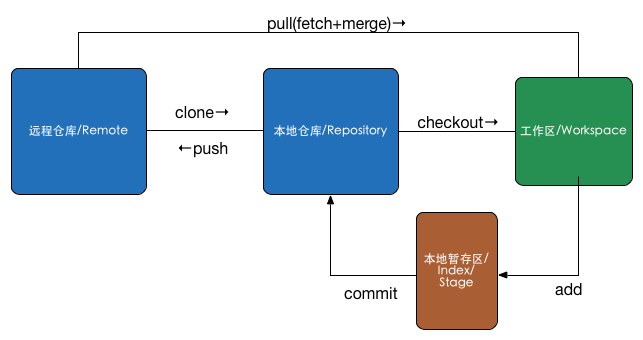
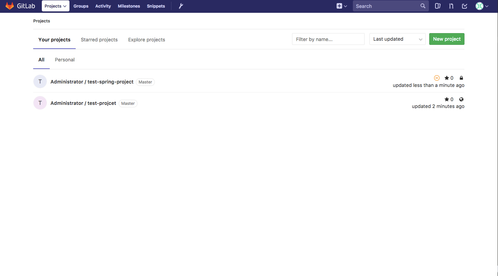
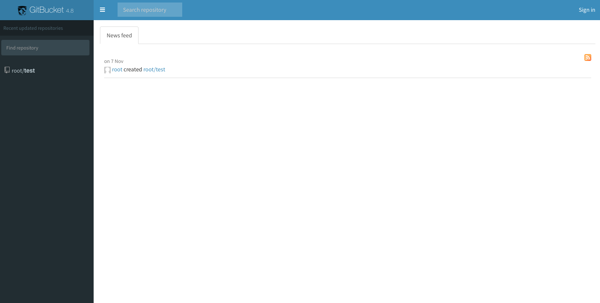
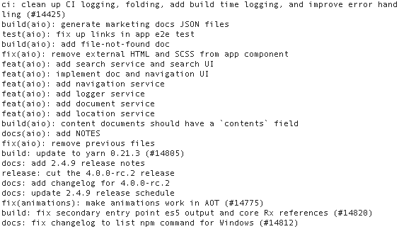
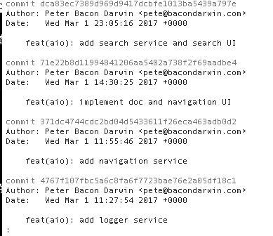
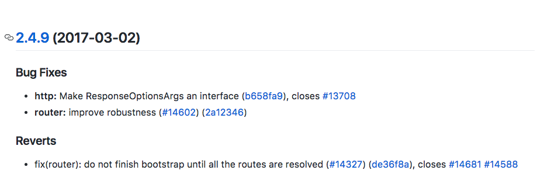

# 2.2 代码版本控制

在平时的开发过程中，尤其是多人协同开发时，经常会遇到以下问题：

- 代码管理混乱
- 代码冲突
- 在代码整合期间引发bug
- 无法对代码的拥有者进行权限控制
- 项目不同版本的发布困难

代码版本控制（Version Control）通过追踪文件的变化解决上述问题。

目前常用的VCS包括SVN和Git。

## 2.2.1 SVN

SVN是前几年用的最为普遍的一个VCS工具，采用了分支管理系统。具有以下几个特点：

- 原子提交。一次提交不管是单个还是多个文件，都是作为一个整体提交的。在这当中发生的意外例如传输中断，不会引起数据库的不完整和数据损坏。
- 重命名、复制、删除文件等动作都保存在版本历史记录当中。对于二进制文件，使用了节省空间的保存方法（只保存和上一版本不同之处）。
- 目录也有版本历史。整个目录树可以被移动或者复制，操作很简单，而且能够保留全部版本记录。
- 分支的开销非常小。
- 优化过的数据库访问，使得一些操作不必访问数据库就可以做到。这样减少了很多不必要的和数据库主机之间的网络流量。
- 集中式版本控制，依赖于中央版本服务器。

SVN版本：1.10.0

### 流程与常用命令


一个通常较简单的SVN工作流程如上图所示。

1. 加入一个新项目的开发时，从项目SVN地址获取代码

    ```
    svn co [svn_url]
    ``` 

1.  把改变的文件添加到版本库中

    ```
    svn add [file]
    ```

    这里可以使用svn add --a可以将所有变动都添加到版本库中。

1. 将改动的文件提交到版本库

    ```
    svn commit -m [LogMessage]
    ```
    
1. 更新到某个版本

    ```
    svn update -r [version] [path]
    ```
    
    svn update如果后面没有目录，默认将当前目录以及子目录下的所有文件都更新到最新版本，如果没有版本号，则更新到最新版本。
    
1. 查看文件或者目录状态

    ```
    svn status [path]
    ```
    
    对应于每一个文件有这几个状态：[?：不在svn的控制中；!:被删除；M：内容被修改；C：发生冲突；A：预定加入到版本库；K：被锁定]。
    
1. 删除文件

    ```
    svn delete path -m “delete test fle“
    svn delete [file]
    svn ci -m [message]
    ```
    
1. 查看日志

    ```
    svn log [path]
    ```
    
1. 查看文件详细信息

    ```
    svn info [path]
    ```
    
1. 比较差异

    ```
    svn diff [path]
    ```
    
    这里是将修改的文件与基础版本比较
    
1. 恢复本地修改

    ```
    svn revert [path]
    ```
    
    恢复原始未改变的工作副本文件（恢复大部份的本地修改）,需要注意的是此命令不会恢复被删除的目录.
    
1. 代码库URL变更

    ```
    svn switch [svn_url]
    ```
    
    switch仅限于同一个repository下的目录之间，switch并不关心切换的目标分支与源分支之间的关系。switch的代价很小，因此应尽量使用switch，而不是完整的check out。
    
1. 解决冲突

    ```
    svn resolved [PATH]
    ```
    
    移除工作副本的目录或文件的“冲突”状态。这里只是移除冲突的相关文件，然后让 PATH 可以再次提交。
        
### 服务器搭建

SVN是集中式版本控制系统，依赖于中央版本服务器的。Windows下使用[VisualSVN Server](https://www.visualsvn.com/server/)即可；Linux下通过官网的源码包编译安装即可，不再详述。

### 提示

- 应尽量避免的操作：
	- 格式化代码，完全改变文件的行号缩进等。
	- 直接用另一个版本的文件覆盖当前文件。
	- 在Windows下更改文件名，但只改了文件名的大小写。
- 保证提交的完整性: 零碎提交功能不完整的代码将引起协同开发的同事以及QA运行代码的困难，且不利于版本的回退等操作。
- 不应提交的文件：以’.’开头的文件、目录，例如.classpath、缩略图文件、class文件。
- 提交代码前务必先`svn update`。

## 2.2.2 Git

Git是一个分布式版本控制系统，相比起SVN的集中式版本控制，每个工作计算机都可以做为版本库，可以不依赖远程仓库服务器离线工作。此外，它的每一个版本库都保存了完整信息，且是按照元数据的方式存储的。

Git版本：2.10.2

### 流程与常用命令



上图所示，使用Git的流程一般如此，通常使用图中的六个命令即可。

1. 克隆项目的Git地址
    
    ```
    git clone [repository url]
    ```
    
1.  切换项目分支
    
    ```
    git checkout [branchName]
    ```
    
1. 增加或改动了一些文件

    ```
    git add [fileName]
    ```
    
    这里也可以使用 git add --a 添加所有变动到暂存区
    
1. 提交文件到本地库

    ```
    git commit -m [message]
    ```
    
    可以使用 git commit -a 跳过git add步骤直接commit。
    
1. 提交到远程库

    ```
    git push origin master
    ```
    
1. 从远程库更新代码并合并

    ```
    git pull
    ```
    
    此命令是 git fetch 和 git merge 的结合。
    
1. 合并不相关的分支

    ```
    git merge [third_repository]/master  --allow-unrelated-histories
    ```
    
    这样即能够合并两个Git项目为一个且保留两个项目的历史记录。其中，third_repository为要合并的项目的远程仓库名称，需要先使用`git remote add third_repository [third_repository_url]`添加为当前项目的远程仓库，并`git fetch third_repository`；`--allow-unrelated-histories`参数则是允许合并不相关的历史记录。
        
此外，现在不管是使用Git官方的服务器作为中央版本库，还是使用Github这种，本地库与远程库交互的一种方式就是通过公私钥来进行的。生成公私钥的命令如下：

```
ssh-keygen -t rsa -C [userName]
```
    
然后按照提示输入相应信息生成成功后，把公钥放置到服务器上即可。

更多的Git使用命令介绍请见附录B。

### 服务器搭建

虽然Git是分布式的，并不需要中央版本服务器即可使用。但是当多人协作时，中央服务器必不可少。

按照官方文档搭建一个Git服务器是比较繁琐的。面对这些复杂的操作步骤以及Git本身上手的门槛，很多人望而却步，造成了之前Git并没有那么普及的状况。而一切从Github横空出世开始改变了，这个看似简单的网站给很多人带来了简单极致方便的代码托管服务，同时也给全世界带来了一股开源的风潮。很多初创公司或者小公司直接选择使用Github建立自己的代码仓库。

与此同时，许多Github的开源实现层出不穷，如今你只需要下载一个类似的实现部署到服务器上，就能拥有自己的“Github”。

目前比较知名、用的较多的Github实现，有以下几个：

- [Gitlab](https://about.gitlab.com/): Ruby on rails实现，是目前最为出名也最为强大的github克隆实现，并且除了版本管理之外，集成了项目管理、持续集成等等很多功能。官网提供了很多操作系统下的一键安装包。遗憾的是，Gitlab现在已经商业化，一些强大的功能只有在其收费版本中才能体验到。
    
- [Gitbucket](https://github.com/gitbucket/gitbucket)：基于Scala编写，极易安装，扔一个war包到Tomcat就完成部署，完全可以和其他如Maven、Jenkins并存在一个JavaEE容器中。虽然功能没有Gitlab那么强大，但胜在简单。更重要的是对于Java工程师来说是友好的，有不满意的直接可以做二次开发。
    

### 工作流

由于Git是分布式版本控制系统，虽然带来了很多优势，但是也同时带来了协同工作的复杂性。因此需要一套基于Git的工作流来规范整个协同流程。目前，比较流行的有以下两种：

- Github workflow
- GitFlow

#### Github workflow

Github workflow是基于github一种常用的工作方式，比较简单。流程分为以下几步：

- 检出新的分支。
- 在开发分支上完成开发工作，commmit并push到远程库分支中。
- 向主分支发起pull request
- 在pull request中发起讨论和修改
- 将开发分支部署测试环境经测试无误后merge回主分支。

这里最为核心的就是基于pull request的协作方式，在类似于Github这种应用中，还可以基于此来进行code review、任务沟通等工作。

#### GitFlow

相比起Github workflow，GitFlow根据Git原来的命令和语义，做了一层语义抽象，多了很多新的定义，从源代码管理角度对通常意义上的软件开发活动进行了约束。流程如下图所示：


其中，GitFlow中定义了两大类分支：

- 主分支：主分支是所有开发活动的核心分支。所有的开发活动产生的输出物最终都会反映到主分支的代码中。    
- 辅助分支：用于组织解决特定问题的各种软件开发活动的分支。辅助分支主要用于组织软件新功能的并行开发、简化新功能开发代码的跟踪、辅助完成版本发布工作以及对生产代码的缺陷进行紧急修复工作。这些分支与主分支不同，通常只会在有限的时间范围内存在。也可以视作临时分支。

其中，主分支又分为：

- master分支：存放的是随时可供在生产环境中部署的代码。当开发活动告一段落，产生了一份新的可供部署的代码时，master分支上的代码会被更新。同时，每一次更新，都添加对应的版本号标签（tag）。
- develop分支: 保存当前最新开发成果的分支。通常这个分支上的代码也是可进行每日夜间发布的代码。当develop分支上的代码已实现了软件需求说明书中所有的功能，通过了所有的测试后，并且代码已经足够稳定时，就可以将所有的开发成果合并回master分支了。

辅助分支又分为：

- feature分支：用于开发新功能时所使用的分支。从develop分支发起feature分支，代码必须合并回develop分支。此分支甚至可以仅仅保存在开发者自己的代码库里而不提交。
- release分支：用于辅助版本发布的分支。从develop分支派生。必须合并回develop分支和master分支。此分支为发布新的产品版本而设计的，当develop上开发的功能基本成型可以发布的时候就可以派生出release版本。在这个分支上的代码允许做小的缺陷修正、准备发布版本所需的各项说明信息，如：版本号、发布时间、编译时间等等。
- hotfix分支：用于修正生产代码中的缺陷的分支。从master分支派生且必须合并回master分支和develop分支。此分支一般是计划外的分支，但最终输出和release分支类似，都可以产生一个新的可供在生产环境部署的软件版本。当生产环境遇到了异常情况或者需要紧急修复的bug时，就可以从master分支上指定的tag版本派生hotfix分支来组织代码的紧急修复工作。

为了简化使用GitFlow模型时Git指令的复杂性，GitFlow的作者开发出了一套Git增强指令集。可以运行于Windows、Linux、Unix和Mac操作系统之下。地址见：<https://github.com/nvie/gitflow>。

### 提示

- .gitignore中添加不需要版本管理的文件，如：.DS_Store、logs、target、node_modules等。根据工程的类型不同这里需要加入的文件也不同。
- git push之前需要先git pull更新代码
- 如果想要忽略已经在版本库里的文件/文件夹，即有一个版本库里的文件你做了改动但并不想被提交版本库中。这时可以使用命令`git update-index --assume-unchanged <file>`，之后可以通过`git update-index -—no-assume-unchanged <file>`恢复跟踪。通过`git ls-files -v | grep -e "^[hsmrck]"`可以列出当前被忽略的、已经纳入版本库管理的文件。
- 使用`git cherry-pick <commit id>`可以选择某一个分支中的一个或几个commit(s)来进行操作。
- 永远不要所有人都在的公共开发分支上做rebase操作。一般情况下在临时分支上是需要rebase主分支代码的，而merge则主要用在主分支上将临时分支的代码合并过来，然后就可以删除临时分支了。

## 2.2.3 提交日志

不论对于SVN还是Git来说，还有一点尤为重要的就是每次提交到代码库时的日志撰写。很多人都认为日志是很没必要的，浪费时间还没啥用,其实撰写清晰规范的格式化日志有助于追踪版本修改、查看历史记录等。SVN的默认配置是允许提交空日志的，但Git却是不允许日志为空的。现在，市面上有很多类似的提交日志规范，这里推荐使用Angular规范，是目前使用最广的写法，比较合理和系统化，并且有配套的工具。

Angular规范的commit message包括三个部分：Header、Body 和 Footer，格式如下。

```
<type>(<scope>): <subject>
// 空一行
<body>
// 空一行
<footer>
```

- type用于说明 commit 的类别，只允许使用下面7个标识。
    
    - feat：新功能（feature）
    - fix：修补bug
    - docs：文档（documentation）
    - style： 格式（不影响代码运行的变动）
    - refactor：重构（即不是新增功能，也不是修改bug的代码变动）
    - test：增加测试
    - chore：构建过程或辅助工具的变动
- scope用于说明 commit 影响的范围，比如数据层、控制层、视图层等等，视项目不同而不同。
- subject是 commit目的的简短描述，不超过50个字符。
- body部分是对本次 commit 的详细描述，可以分成多行。
- footer部分只用于两种情况: 不兼容变动时，以BREAKING CHANGE开头，后面是对变动的描述、以及变动理由和迁移方法；如果当前 commit 针对某个issue，那么可以在 Footer 部分关闭这个issue。
- 还有一种特殊情况，如果当前commit用于撤销以前的commit，则必须以revert:开头，后面跟着被撤销 Commit 的 Header。Body部分的格式是固定的，必须写成This reverts commit <hash>.，其中的hash是被撤销commit的 SHA 标识符。

一个符合Angular规范的commit message例子如下：


如此规范commit message，可以带来以下好处：

- 提供更多的历史信息，方便快速浏览。可以对代码的历史记录一目了然，能够大体上知道每次提交都做了什么。
    
    ```
    git log [last tag] HEAD --pretty=format:%s
    ```
    
    
    
- 可以过滤某些commit（比如文档改动），便于快速查找信息。比如要查看新增加的功能。

    ```
    git log [last release] HEAD --grep feat
    ```
    
    
    
- 使用[conventional-changelog](https://github.com/ajoslin/conventional-changelog)可以直接从commit生成change log(发布新版本时，用来说明与上一个版本差异的文档)。

    ```
    conventional-changelog -p angular -i CHANGELOG.md -w
    ```
    
    
    
此外，可以使用[Commitizen](https://github.com/commitizen/cz-cli)来撰写符合规范的commit message。

虽然以上介绍使用Git来做示例的，但是对于SVN也是可以按照此套规范来进行的。


